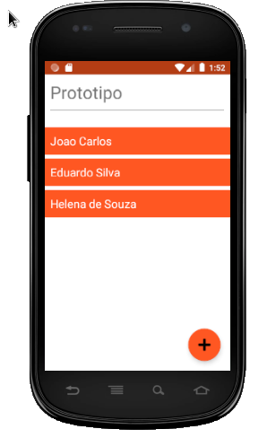
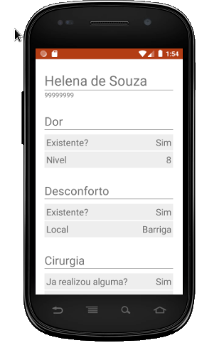

# Aplicativo Mobile da aplicação protótipo

## Descrição

O aplicativo utiliza componentes Materias (do Google) e a biblioteca ROOM para armazenamento dos dados.

## Requisitos

A API possui dois requisitos:

1. Android Studio OU um Celular para testar o APK

## Setup

### Android Studio

Basta abrir a pasta dentro do Android Studio e rodar o aplicativo.

### Testando em um Celular

Você deve habilitar a instalação por apk em seu celular, e em seguida, instalar o apk que se encontra em p1_apk/app/build/outputs/apk/debug/app-debug.apk

### Notas

Ele foi feito para funcionar mesmo se rotacionar a tela
