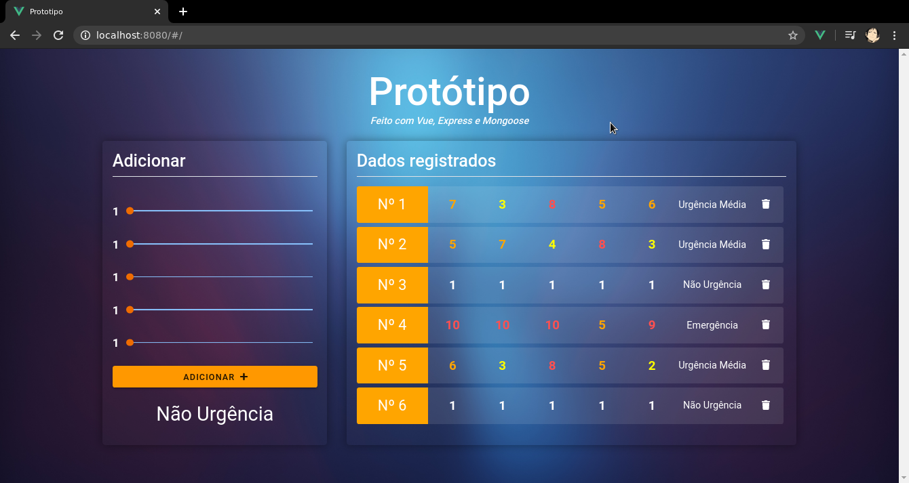

# Frontend da aplicação protótipo



## Descrição

O sistema é uma aplicação SPA (Single Page Application), onde você pode adicionar e remover os conjuntos de dados ao banco.
O banco de dados é lido localmente.

Para a funcionalidade, foram usados Vue e Mongoose, enquanto que para o design foram utilizados Bootstrap e Vuetify.

## Requisitos

O aplicativo possui um requisito:
1. A API (p1_back) deve estar em funcionamento na máquina local (para instruções sobre, [Clique aqui](../p1_back/README.md))


## Setup

```
# Obrigatório para instalar os pacotes necessários
npm install

npm run serve
```

### Notas

À adicionar